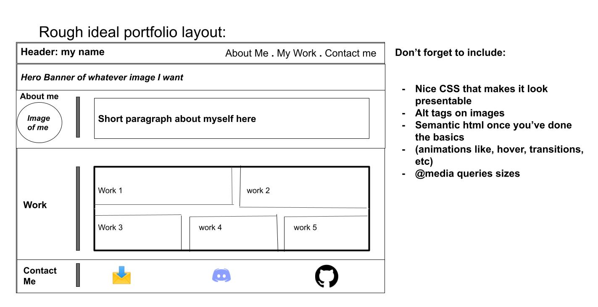
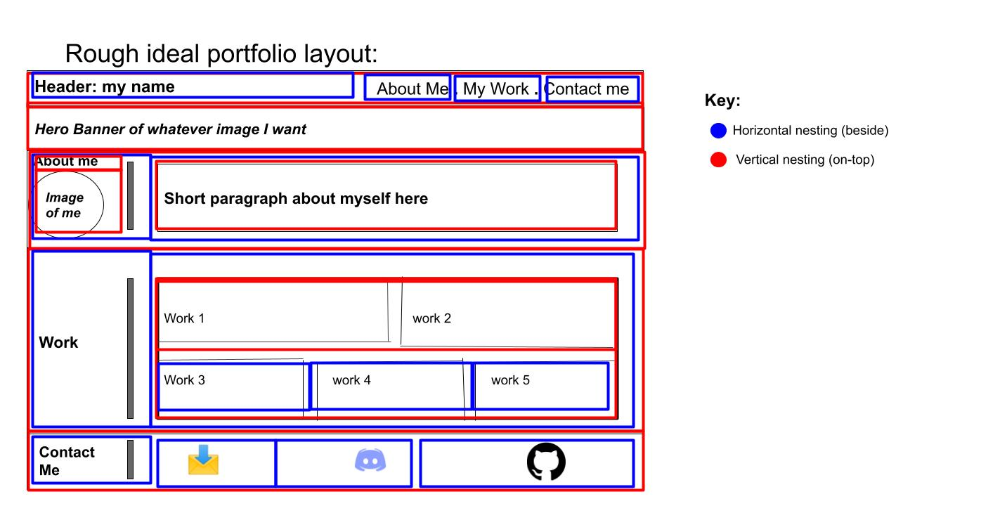

# my-portfolio

I am creating a starter portfolio which I will be developing as I make more deployed projects. 

Below, you will see that I have created a rough sketch on how I'd ideally like my portfolio to be formatted like, alongside some of the functions I'd like to include. 

